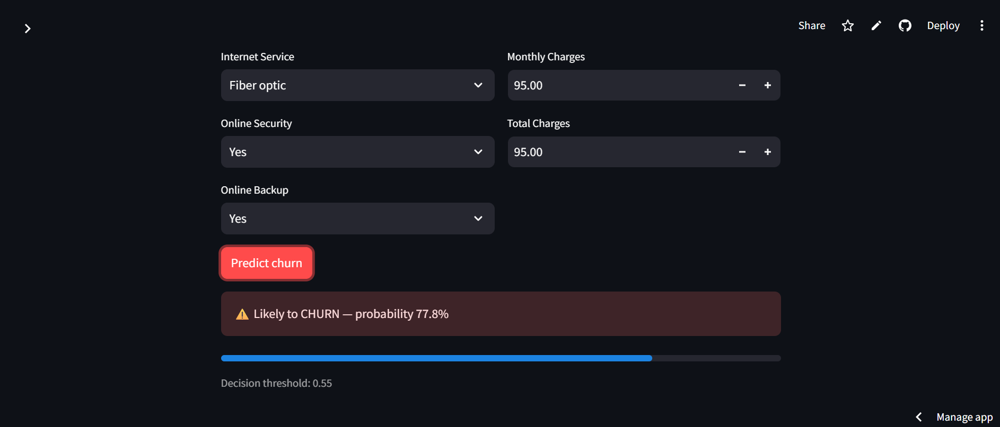
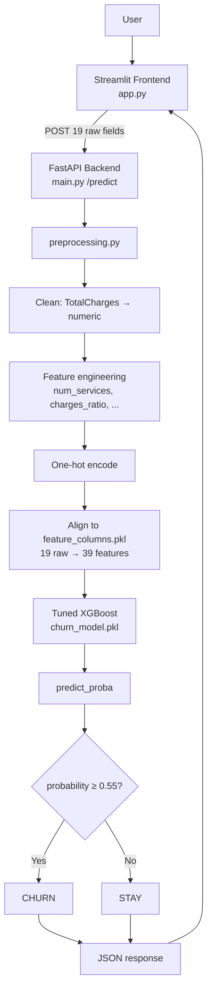
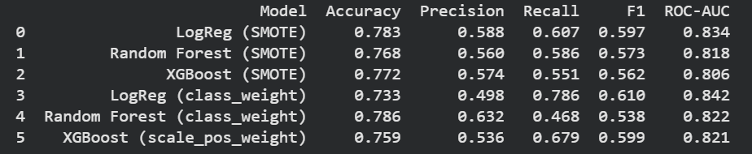
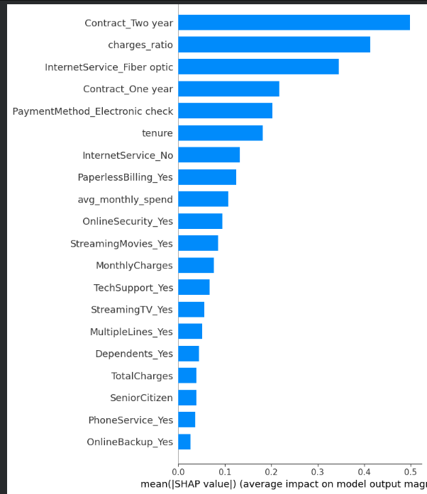

# 📉 Customer Churn Prediction

End-to-end machine learning project that predicts whether a telecom customer will **churn** (leave the company), served as a live **FastAPI + Streamlit** application. Built on the industry-standard Telco Customer Churn dataset, with feature engineering, class-imbalance handling, multi-model comparison, threshold tuning, and **SHAP explainability**.

**Honest headline results:** `79% accuracy` · `69% recall` · **`0.85 ROC-AUC`** (benchmark-level), decision threshold `0.55`.

---

## 🔗 Live Demo

- **App (Streamlit):** https://churn-prediction-cdjwvkq826ff47zqfo74zc.streamlit.app/
- **API docs (FastAPI /docs):** https://churn-docker.onrender.com/docs

> ⚠️ Free-tier note: the API sleeps after ~15 min idle, so the **first** prediction may take ~50 s to wake it, then it's fast.



---

## 💼 Business Problem

Acquiring a new customer costs far more than retaining an existing one. If a telecom provider can identify **which customers are likely to leave** — *before* they actually do — it can target them with retention offers, support, or better pricing.

This project frames that as a **binary classification** problem: given a customer's account details and service usage, predict the probability that they will churn, so the business can act on the high-risk ones.

A key real-world wrinkle: churn data is **imbalanced** (most customers stay). That makes raw accuracy misleading — a lazy model that predicts "everyone stays" scores ~73% accuracy while catching **zero** churners. So this project optimizes for **recall and ROC-AUC**, not accuracy.

---

## 🏗️ Architecture



The model is **trained once** (in the notebook) and saved as a `.pkl`. The API **loads** it at startup — it never retrains. All preprocessing is replicated exactly in `preprocessing.py` so a live customer is transformed identically to the training data.

---

## 🧰 Tech Stack

| Layer | Tools |
|---|---|
| **ML / Data** | pandas, numpy, scikit-learn, **XGBoost**, **SHAP** |
| **Imbalance** | `scale_pos_weight` (class weighting) |
| **Backend** | **FastAPI**, Uvicorn, Pydantic |
| **Frontend** | **Streamlit** |
| **Serialization** | joblib |
| **Deployment** | Render (backend) · Streamlit Cloud (frontend) · Docker |

---

## 🔬 Methodology & Approach

The final number matters less than the **process** used to get an honest, trustworthy model. Here is what was tried and why.

**1. Feature engineering (matters more than model choice).**
Six features were derived from the raw data to give the model more signal:
- `num_services` — how many internet add-on services the customer subscribes to
- `tenure_x_monthly` — interaction of tenure and monthly charge
- `avg_monthly_spend` — lifetime spend normalized by tenure
- `charges_ratio` — monthly charge relative to total charges
- `is_new_customer` — first-year flag
- `tenure_group` — binned tenure

**2. Handling class imbalance.**
Churners are the minority. Two strategies were compared — **SMOTE** (synthetic oversampling) vs **class weighting** (`scale_pos_weight`). Class weighting won on this dataset and was used in the final model.

**3. Comparing multiple models.**
Three models were benchmarked — **Logistic Regression** (baseline), **Random Forest**, and **XGBoost** — each under both imbalance strategies. Tree ensembles are state-of-the-art on tabular data, and after tuning XGBoost came out ahead.



*Baseline comparison across imbalance strategies and models (**before** tuning). `XGBoost + scale_pos_weight` was selected, then tuned with `RandomizedSearchCV` → final metrics in [Results](#-results) below. Note the baselines are competitive — tuning is what pushed XGBoost's ROC-AUC from 0.821 to **0.848**.*

**4. Tuning + threshold optimization.**
XGBoost was tuned with `RandomizedSearchCV`, then the best hyperparameters were **hardcoded** for reproducibility (a searched model can drift between runs — you tune once, then lock it for deployment). The decision threshold was moved from the default 0.50 to **0.55** to better balance precision and recall.

**5. Knowing when to stop.**
A stacking ensemble was tested but did **not** beat XGBoost, confirming a real performance ceiling on this data. Chasing 85%+ accuracy on the Telco dataset honestly requires either data leakage or overfitting — so tuning was stopped deliberately. **Recognizing that ceiling is itself an engineering decision.**

**6. Why not rely on accuracy?**
Because it lies on imbalanced data. The model is judged on **recall** (catch real churners), **F1**, and **ROC-AUC** (ranking quality) instead.

---

## 📊 Results

Final model: **tuned XGBoost** trained on the original imbalanced data with `scale_pos_weight=2`, threshold `0.55`.

| Metric | Score |
|---|---|
| Accuracy | 0.795 |
| Precision | 0.599 |
| Recall | 0.687 |
| F1 | 0.640 |
| **ROC-AUC** | **0.848** |

**Confusion matrix** (test set):

|  | Predicted Stay | Predicted Churn |
|---|---|---|
| **Actual Stay** | 863 | 172 |
| **Actual Churn** | 117 | 257 |

→ Caught **257 of 374** real churners (69% recall), with 172 false alarms. On an imbalanced problem where accuracy is deceptive, a **0.85 ROC-AUC** is a strong, benchmark-level result.

---

## 🧠 Explainability (SHAP)

SHAP was used to open the "black box" and show **why** the model predicts what it does — globally (top churn drivers overall) and locally (why a specific customer was flagged).

The strongest drivers were `Contract` type, the **engineered** feature `charges_ratio` (the **#2 driver overall**), `InternetService = Fiber optic`, `PaymentMethod = Electronic check`, and `tenure` — with the engineered `avg_monthly_spend` also contributing. An engineered feature ranking second confirms the feature engineering added real signal, not noise.



---

## 📁 Project Structure

```
churn-prediction/
├── notebooks/        # ML training: EDA, feature engineering, model comparison, SHAP
├── data/             # Telco Customer Churn dataset
├── model/
│   ├── churn_model.pkl        # trained XGBoost
│   └── feature_columns.pkl    # the 39-feature template
├── preprocessing.py  # replicates the training pipeline (19 raw → 39 features)
├── main.py           # FastAPI backend (/predict, /health)
├── app.py            # Streamlit frontend
├── screenshots/      # app + notebook screenshots
├── requirements.txt
└── README.md
```

---

## ▶️ Running Locally

```bash
pip install -r requirements.txt

# Backend
python main.py                      # serves http://localhost:8000  (/docs)

# Frontend (new terminal)
streamlit run app.py                # set API_URL to the backend URL
```

**Example API call:**
```bash
curl -X POST http://localhost:8000/predict \
  -H "Content-Type: application/json" \
  -d '{"gender":"Female","SeniorCitizen":0,"Partner":"Yes","Dependents":"No","tenure":3,"PhoneService":"Yes","MultipleLines":"No","InternetService":"Fiber optic","OnlineSecurity":"No","OnlineBackup":"No","DeviceProtection":"No","TechSupport":"No","StreamingTV":"No","StreamingMovies":"No","Contract":"Month-to-month","PaperlessBilling":"Yes","PaymentMethod":"Electronic check","MonthlyCharges":85.7,"TotalCharges":257.1}'
```
```json
{"churn": true, "churn_probability": 0.5527, "threshold": 0.55}
```

---

## 📚 Dataset

[Telco Customer Churn](https://www.kaggle.com/datasets/blastchar/telco-customer-churn) — 7,043 customers, 21 columns (demographics, services, account info, churn label).
